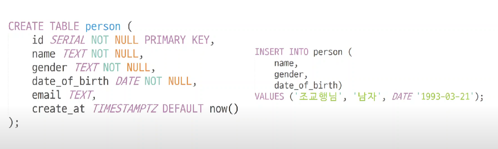

# Postgresql 찍먹하기
- sudo service postgresql start
- sudo -u postgres psql
- \l => DB 보기
- CREATE DATABASE 이름; => DB 만들기
- CREATE TABLE 이름; => table 만들기
- \c test => test DB에 연결하기
- \d 연결된 DB의 전체 테이블 확인
- 주요 데이터 타입
  - INT: 정수
  - SERIAL : 시퀀스 숫자
  - TEXT: 문자열
  - BOOL: 불린
  - DATE: 날짜
  - TIMESTAMPTZ : 타입존이 포함된 날짜 및 시간

- TablePluse 
  - TablePlus는 주요 관계형 데이터베이스 시스템(예: MySQL, PostgreSQL, SQLite, Microsoft SQL Server 등)뿐만 아니라 NoSQL 데이터베이스 시스템(예: MongoDB)과도 연결할 수 있습니다. 이를 통해 사용자는 여러 데이터베이스 시스템을 하나의 도구에서 효율적으로 관리하고 쿼리를 실행하며, 테이블을 생성하고 수정할 수 있습니다. 또한, TablePlus는 데이터베이스 연결, 스키마 비교, 데이터 덤프 및 복원, 쿼리 히스토리, SSH 터널링 등의 기능을 제공하여 개발 작업을 지원합니다.
